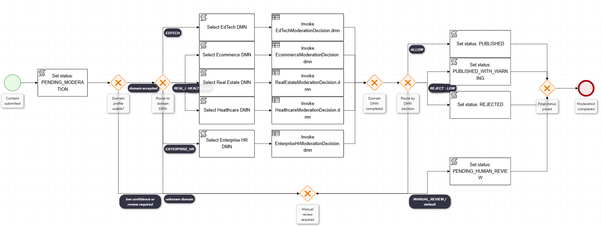
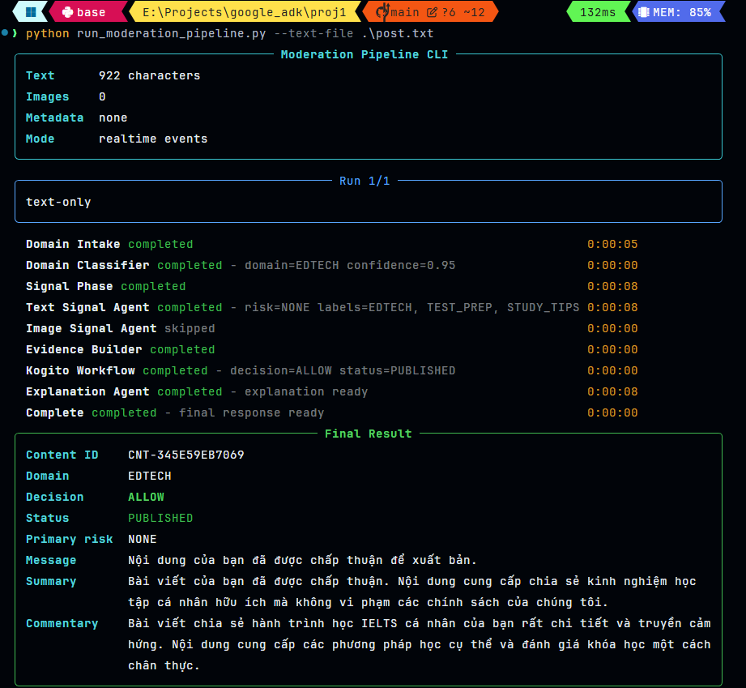

# Agentic Moderation System

Agentic Moderation System is a domain-aware, multi-agent pre-publication content moderation project. It combines Google ADK agents for language-based analysis and explanation with Kogito BPMN/DMN assets for deterministic workflow routing and final policy decisions.

## Purpose

The project demonstrates a production-oriented moderation architecture where:

- AI agents collect and explain evidence.
- DMN decision tables own deterministic policy decisions.
- BPMN owns workflow orchestration and routing.
- The backend exposes synchronous and streaming moderation APIs.
- A CLI can run the full pipeline directly for testing and debugging.

This separation keeps moderation logic auditable while still allowing agents to handle ambiguous language, domain context, and explanation quality.


## Architecture



The moderation pipeline follows this flow:

1. A client submits a moderation request with text, optional image URL, and metadata.
2. `DomainIntakeAgent` prepares a compact classification payload.
3. Kogito `DomainClassificationDecision.dmn` returns the detected domain and analysis profile.
4. `ContentSignalAgent` generates text moderation signals for that domain.
5. `ImageSignalAgent` runs when an image is present.
6. `ModerationEvidenceAgent` builds BPMN-ready process variables.
7. Kogito BPMN starts the pre-publication moderation workflow.
8. Domain-specific DMN assets decide the final moderation route.
9. `ExplanationAgent` produces user-facing and admin-facing explanations.
10. The backend returns a structured `ModerationResponse`.

Agents do not return final policy decisions. Final decisions come from Kogito BPMN/DMN.

## Repository Layout

```text
.
├── backend/
│   ├── app/
│   │   ├── agents/
│   │   │   ├── _shared.py
│   │   │   ├── content_signal_agent.py
│   │   │   ├── domain_intake_agent.py
│   │   │   ├── explanation_agent.py
│   │   │   ├── image_signal_agent.py
│   │   │   └── moderation_evidence_agent.py
│   │   ├── api/
│   │   │   └── routes.py
│   │   ├── kogito/
│   │   │   ├── client.py
│   │   │   ├── domain_classifier_client.py
│   │   │   ├── factory.py
│   │   │   └── workflow_client.py
│   │   ├── prompts/
│   │   │   ├── domains/
│   │   │   ├── content_signal_base.md
│   │   │   ├── explanation_base.txt
│   │   │   ├── image_signal_base.md
│   │   │   └── loader.py
│   │   ├── repositories/
│   │   │   └── moderation_repository.py
│   │   ├── schemas/
│   │   │   └── moderation.py
│   │   ├── services/
│   │   │   └── moderation_service.py
│   │   ├── main.py
│   │   └── settings.py
│   ├── README.md
│   └── requirements.txt
├── kogito-moderation-service/
│   ├── src/main/resources/bpmn/
│   │   └── pre_publication_moderation_process.bpmn2
│   ├── src/main/resources/dmn/
│   │   ├── DomainClassificationDecision.dmn
│   │   ├── EcommerceModerationDecision.dmn
│   │   ├── EdTechModerationDecision.dmn
│   │   ├── EnterpriseHrModerationDecision.dmn
│   │   ├── HealthcareModerationDecision.dmn
│   │   └── RealEstateModerationDecision.dmn
│   ├── README.md
│   └── pom.xml
├── frontend/
├── assets/
│   ├── BPMN.png
│   └── example_cli.png
├── kogito-openapi.yaml
├── post.txt
├── post_samples.md
├── run_moderation_pipeline.py
└── run_post_samples.py
```

## Main Components

### FastAPI Backend

The backend is the main application boundary. It validates requests, creates the moderation service, invokes agents, calls Kogito, stores results in an in-memory repository, and exposes HTTP endpoints.

Main files:

- `backend/app/main.py`: FastAPI application startup.
- `backend/app/api/routes.py`: HTTP routes and dependency wiring.
- `backend/app/services/moderation_service.py`: full moderation pipeline orchestration.
- `backend/app/settings.py`: environment-based settings.

### Google ADK Agents

The project uses Google ADK agents for language and explanation tasks:

- `DomainIntakeAgent`: extracts domain hints and classification payload fields.
- `ContentSignalAgent`: generates domain-aware text moderation signals.
- `ImageSignalAgent`: generates image-related signals from URL, filename, metadata, and supplied OCR-like context.
- `ExplanationAgent`: creates detailed user-facing and admin-facing explanations.

`ModerationEvidenceAgent` is deterministic by design. It converts classification and signal outputs into BPMN process variables.

### Kogito BPMN and DMN

Kogito owns deterministic workflow and decision logic:

- `DomainClassificationDecision.dmn`: classifies content domain and returns prompt/profile routing hints.
- `pre_publication_moderation_process.bpmn2`: orchestrates the moderation workflow.
- Domain-specific DMN files determine final moderation outcomes for each supported domain.

## Prerequisites

Install the following:

- Python 3.11 or newer
- Java JDK 17
- Maven 3.9 or newer
- Google ADK-compatible credentials for the selected Gemini model
- A terminal with UTF-8 support

The backend dependencies are listed in:

```text
backend/requirements.txt
```

## Environment Variables

The backend uses `pydantic-settings` and loads `.env` from the project root.

Common settings:

```env
KOGITO_BASE_URL=http://localhost:8080
KOGITO_TIMEOUT_SECONDS=10
BACKEND_HOST=0.0.0.0
BACKEND_PORT=8000
```
Google ADK and Gemini authentication depends on your local Google setup. Configure the credentials required by `google-adk` and the Gemini client in your environment before running the pipeline.

## Installation

## Start the Kogito Service

Kogito must be running before the backend or CLI can complete a full moderation request.

```powershell
cd e:\Projects\google_adk\proj1\kogito-moderation-service
mvn clean compile quarkus:dev
```

## Run the Full Pipeline from CLI

The CLI runs the moderation service directly without starting FastAPI. Kogito still needs to be running.



Run with a text file:

```powershell
python run_moderation_pipeline.py --text-file .\post.txt
```

Run with an image path:

```powershell
python run_moderation_pipeline.py --text-file .\post.txt --image-path .\image.png
```

Run with multiple images:

```powershell
python run_moderation_pipeline.py --text-file .\post.txt --image-path .\image1.png --image-path .\image2.png
```

Run with metadata:

```powershell
python run_moderation_pipeline.py --text-file .\post.txt --metadata-json '{"source_channel":"community_feed","declared_category":"marketplace"}'
```

Print realtime pipeline stages:

```powershell
python run_moderation_pipeline.py --text-file .\post.txt --stream
```

Print machine-readable JSON:

```powershell
python run_moderation_pipeline.py --text-file .\post.txt --json
```

Print event stream as JSON lines:

```powershell
python run_moderation_pipeline.py --text-file .\post.txt --stream --json
```

Save the final result:

```powershell
python run_moderation_pipeline.py --text-file .\post.txt --output result.json
```

## Response Shape

The backend returns a `ModerationResponse`:

```json
{
  "content_id": "CNT-123456789ABC",
  "status": "REJECTED",
  "decision": "REJECT",
  "message": "Bài viết chưa thể được đăng vì có dấu hiệu vi phạm chính sách nội dung.",
  "detected_domain": "ECOMMERCE",
  "analysis_profile": "ECOMMERCE_MARKETPLACE",
  "workflow": {
    "process_id": "pre_publication_moderation_process",
    "domain_dmn": "EcommerceModerationDecision",
    "dmn_decision": "REJECT",
    "status": "REJECTED"
  },
  "signals": {
    "primary_risk": "SCAM",
    "spam_score": 0.2,
    "scam_score": 0.9,
    "has_image": false,
    "image_risk_score": 0.0
  },
  "evidence": {
    "evidence_id": "EVD-123456789ABC"
  },
  "explanations": {
    "user_message": "Bài viết chưa thể được đăng vì có dấu hiệu vi phạm chính sách nội dung.",
    "verdict_summary": "The final outcome explained for the author.",
    "article_commentary": "Specific comments about the submitted content.",
    "policy_reasons": ["Reason supported by signals."],
    "recommended_edits": ["Safe edit suggestion."],
    "resubmission_guidance": "What the author should do next.",
    "admin_explanation": "Operational reviewer explanation.",
    "risk_summary": {
      "primary_risk": "SCAM",
      "strongest_signals": ["off_platform_payment"],
      "image_notes": []
    },
    "redacted": true
  }
}
```

## Moderation Decisions

Supported public decisions:

```text
ALLOW
WARN_ALLOW
REJECT
MANUAL_REVIEW
```

Supported content statuses:

```text
PUBLISHED
PUBLISHED_WITH_WARNING
REJECTED
PENDING_HUMAN_REVIEW
```

## Supported Domains

```text
EDTECH
ECOMMERCE
REAL_ESTATE
HEALTHCARE
ENTERPRISE_HR
UNKNOWN
```
## Development Notes

- The moderation repository is in-memory. Results are lost when the backend process restarts.
- Image analysis currently does not fetch or decode remote or local image bytes. It uses image URL text, filename, metadata, and any OCR-like text supplied in metadata.
- The CLI converts local image paths to `file:///...` URIs so the existing request schema can carry them.
- The backend opens a Kogito HTTP client per moderation service dependency and closes it after use.
- Agent output is normalized before being passed into the workflow or API response.
- Final policy decisions should remain in DMN/BPMN, not in prompt text.
